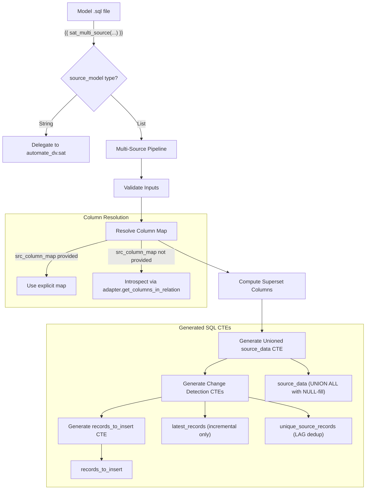
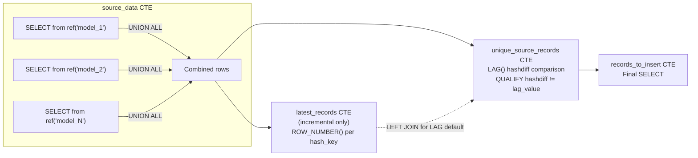
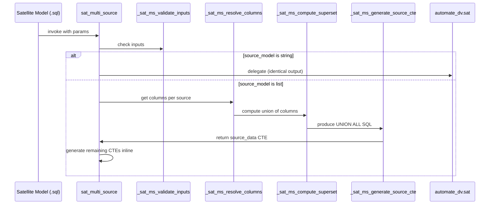

# Design Document: Multi-Source Satellite Macro

## Overview

The `sat_multi_source` macro is a custom dbt Jinja macro that extends the automate_dv `sat` macro to support multiple source models with non-identical payload columns. It solves two limitations of the current approach:

1. **`ref()` requires a string**: The automate_dv `sat` macro calls `ref(source_model)` directly, which fails when `source_model` is a list.
2. **UNION ALL requires identical schemas**: The current workaround (creating a separate union view like `stg2_aug_sat_agreement_union.sql`) only works when all contributing models share exactly the same columns.

The macro dynamically generates a unioned `source_data` CTE with NULL-filling for missing columns, then reuses the automate_dv satellite change-detection pattern (hashdiff-based deduplication via LAG window functions) and supports Snowflake incremental materialization.

### Design Rationale

Rather than forking the automate_dv `sat` macro or monkey-patching it via dispatch overrides, this design creates a standalone macro that:
- Delegates to `automate_dv.sat()` when given a single string (zero behavioral change)
- Generates the full satellite SQL inline when given a list (replicating the automate_dv CTE structure with a modified `source_data` CTE)

This approach avoids coupling to automate_dv internals for the single-source case while giving full control over the multi-source SQL generation.

## Architecture



### CTE Flow Diagram



## Components and Interfaces

### Macro: `sat_multi_source`

**File**: `macros/sat_multi_source.sql`

**Signature**:
```sql

```

**Parameters**:

| Parameter | Type | Required | Description |
|-----------|------|----------|-------------|
| `src_pk` | string | Yes | Hash key column name (e.g., `'AGREEMENT_HK'`) |
| `src_hashdiff` | string | Yes | Hashdiff column name (e.g., `'HASHDIFF'`) |
| `src_payload` | list of strings | Yes | Payload column names (used as authoritative superset when provided) |
| `src_extra_columns` | string or list | No | Additional columns to include in output |
| `src_eff` | string | No | Effectivity date column for effectivity satellites |
| `src_ldts` | string | Yes | Load datetime column name (e.g., `'LOAD_DATETIME'`) |
| `src_source` | string | Yes | Record source column name (e.g., `'RECORD_SOURCE'`) |
| `source_model` | string or list | Yes | Single model name or list of model names |
| `src_column_map` | dict | No | Explicit mapping of model names to their available payload columns |

### Internal Helper Functions

#### `_sat_ms_validate_inputs`
Validates all input parameters and raises compile-time errors for invalid configurations.

#### `_sat_ms_resolve_columns`
Resolves per-source column availability using either the explicit `src_column_map` or `adapter.get_columns_in_relation()`.

#### `_sat_ms_compute_superset`
Computes the case-insensitive distinct union of payload columns across all sources, excluding system columns.

#### `_sat_ms_generate_source_cte`
Generates the `source_data` CTE with UNION ALL and NULL-filling.

### Component Interaction



## Data Models

### Input Model Schema (per source staging table)

Each source staging table is expected to contain at minimum:
- `<src_pk>` — Hash key column (NOT NULL for valid rows)
- `<src_hashdiff>` — Hashdiff column (computed over payload columns for that source)
- `<src_ldts>` — Load datetime column
- `<src_source>` — Record source column
- Zero or more payload columns (subset of the superset)

### Generated Satellite Table Schema

| Column | Type | Description |
|--------|------|-------------|
| `<src_pk>` | BINARY/VARCHAR | Hash key (from hub) |
| `<src_hashdiff>` | BINARY/VARCHAR | Hashdiff of payload values |
| Payload columns (alphabetical) | VARCHAR (or source type) | Attribute values; NULL when source doesn't contribute |
| `<src_ldts>` | TIMESTAMP_NTZ | Load datetime |
| `<src_source>` | VARCHAR | Record source identifier |

### `src_column_map` Data Structure

```yaml
src_column_map:
  stg2_model_a:
    - COL_A
    - COL_B
    - COL_C
  stg2_model_b:
    - COL_B
    - COL_D
```

This produces a superset of `[COL_A, COL_B, COL_C, COL_D]`. Model A's SELECT includes `COL_A, COL_B, COL_C` directly and `CAST(NULL AS VARCHAR) AS COL_D`. Model B's SELECT includes `CAST(NULL AS VARCHAR) AS COL_A`, `COL_B`, `CAST(NULL AS VARCHAR) AS COL_C`, `COL_D`.

## Low-Level Design

### Algorithm: Multi-Source SQL Generation

```
FUNCTION sat_multi_source(params):
    1. VALIDATE inputs (types, required params, list entries)
    2. IF source_model IS string:
         RETURN automate_dv.sat(same params)
    3. RESOLVE column map:
       a. IF src_column_map provided → use it
       b. ELSE → introspect each ref(model) via adapter
    4. COMPUTE superset:
       a. Collect all columns from all sources
       b. Exclude system columns (src_pk, src_hashdiff, src_ldts, src_source, src_eff)
       c. Deduplicate case-insensitively
       d. IF src_payload provided → use as authoritative superset
       e. Sort alphabetically
    5. GENERATE source_data CTE:
       FOR EACH model in source_model:
         SELECT src_pk, src_hashdiff,
                FOR EACH col in sorted_superset:
                  IF col IN source_columns[model] → col
                  ELSE → CAST(NULL AS VARCHAR) AS col
                src_ldts, src_source
         FROM ref(model)
         WHERE src_pk IS NOT NULL
       JOIN with UNION ALL
    6. GENERATE latest_records CTE (if incremental):
       SELECT src_pk, src_hashdiff, src_ldts
       FROM this
       JOIN (SELECT DISTINCT src_pk FROM source_data)
       QUALIFY ROW_NUMBER() OVER (PARTITION BY src_pk ORDER BY src_ldts DESC) = 1
    7. GENERATE unique_source_records CTE:
       SELECT all source_cols FROM source_data
       LEFT JOIN latest_records (if incremental)
       QUALIFY src_hashdiff != LAG(src_hashdiff, 1, COALESCE(lr.hashdiff, 0xFFFFFFFF))
               OVER (PARTITION BY src_pk ORDER BY src_ldts ASC)
    8. GENERATE records_to_insert:
       SELECT * FROM unique_source_records
    9. OUTPUT: SELECT * FROM records_to_insert
```

### Pseudocode: Core Macro Logic

```jinja


    {#-- Step 1: Validate inputs --#}
    
        {{ exceptions.raise_compiler_error("source_model is required") }}
    

    {#-- Step 2: Single-string delegation --#}
    
        {{ automate_dv.sat(src_pk=src_pk, src_hashdiff=src_hashdiff,
                           src_payload=src_payload, src_extra_columns=src_extra_columns,
                           src_eff=src_eff, src_ldts=src_ldts,
                           src_source=src_source, source_model=source_model) }}
    
        {#-- Multi-source path --#}

        {#-- Validate list is non-empty --#}
        
            {{ exceptions.raise_compiler_error("source_model list must contain at least one model name") }}
        

        {#-- Validate each entry is a non-empty string --#}
        
            
                {{ exceptions.raise_compiler_error("source_model entry at position " ~ loop.index ~ " must be a non-empty string") }}
            
        

        {#-- Step 3: Resolve columns per source --#}
        
        
            {#-- Use explicit column map --#}
            
                
                    
                
                    
                
            
        
            {#-- Introspect via adapter --#}
            
                
                
                
                
            
        

        {#-- Step 4: Compute superset --#}
        
        
            
        

        
            {#-- src_payload is authoritative superset --#}
            
        
            {#-- Derive from all sources --#}
            
            
            
                
                    
                        
                        
                    
                
            
            
        

        {#-- Include src_extra_columns in superset if provided --#}
        
            
            
                
                    
                
            
            
        

        {#-- Validate we have payload columns --#}
        
            {{ exceptions.raise_compiler_error("No payload columns found across source models") }}
        

        {#-- Step 5: Generate SQL --#}
        {#-- ... (see Generated SQL section below) --#}

    
        {{ exceptions.raise_compiler_error("source_model must be a string or a list of strings") }}
    


```

### Generated SQL Template (Multi-Source Path)

```sql
-- Generated by sat_multi_source macro

WITH source_data AS (
    -- Source 1: model_a
    SELECT
        a.AGREEMENT_HK,
        a.HASHDIFF,
        a.COL_A,
        a.COL_B,
        CAST(NULL AS VARCHAR) AS COL_C,
        a.LOAD_DATETIME,
        a.RECORD_SOURCE
    FROM {{ ref('model_a') }} AS a
    WHERE a.AGREEMENT_HK IS NOT NULL

    UNION ALL

    -- Source 2: model_b
    SELECT
        a.AGREEMENT_HK,
        a.HASHDIFF,
        CAST(NULL AS VARCHAR) AS COL_A,
        a.COL_B,
        a.COL_C,
        a.LOAD_DATETIME,
        a.RECORD_SOURCE
    FROM {{ ref('model_b') }} AS a
    WHERE a.AGREEMENT_HK IS NOT NULL
),


latest_records AS (
    SELECT
        current_records.AGREEMENT_HK,
        current_records.HASHDIFF,
        current_records.LOAD_DATETIME
    FROM {{ this }} AS current_records
    JOIN (
        SELECT DISTINCT source_data.AGREEMENT_HK
        FROM source_data
    ) AS source_records
        ON source_records.AGREEMENT_HK = current_records.AGREEMENT_HK
    QUALIFY ROW_NUMBER() OVER (
        PARTITION BY current_records.AGREEMENT_HK
        ORDER BY current_records.LOAD_DATETIME DESC
    ) = 1
),


unique_source_records AS (
    SELECT
        sd.AGREEMENT_HK,
        sd.HASHDIFF,
        sd.COL_A,
        sd.COL_B,
        sd.COL_C,
        sd.LOAD_DATETIME,
        sd.RECORD_SOURCE
    FROM source_data AS sd
    
    LEFT OUTER JOIN latest_records AS lr
        ON sd.AGREEMENT_HK = lr.AGREEMENT_HK
    
    QUALIFY sd.HASHDIFF !=
        LAG(sd.HASHDIFF, 1,
            COALESCE(
                lr.HASHDIFF,
                CAST('FFFFFFFF' AS BINARY(4))
            )
        ) OVER (
            PARTITION BY sd.AGREEMENT_HK
            ORDER BY sd.LOAD_DATETIME ASC
        )
),

records_to_insert AS (
    SELECT * FROM unique_source_records
)

SELECT * FROM records_to_insert
```

### Macro File Structure

The macro will be implemented as a single file `macros/sat_multi_source.sql` containing:
1. The main `sat_multi_source` macro (entry point)
2. Internal helper macros prefixed with `_sat_ms_` (optional — can be inlined if complexity is manageable)

Given the macro's moderate complexity and the project's existing style (simple, self-contained macro files), the implementation will use a single macro with inline logic rather than splitting into separate helper macros. This matches the style of `hash.sql` and `location_address_key.sql` in the project.

### Key Implementation Details

1. **Column name normalization**: All column name comparisons use `| upper` filter for case-insensitive matching.

2. **NULL-fill cast type**: Uses `CAST(NULL AS VARCHAR)` as the default type for NULL-filled columns. This is compatible with Snowflake's implicit type coercion and ensures the UNION ALL succeeds without type mismatches.

3. **Hashdiff computation assumption**: The hashdiff is computed in the upstream staging model over that source's payload columns only. When NULL-filled columns are added, they do NOT affect the hashdiff (it was already computed upstream). This is intentional — the satellite tracks "did this source's known attributes change?" rather than "are all sources identical?"

4. **Binary sentinel value**: The LAG default uses `CAST('FFFFFFFF' AS BINARY(4))` following the automate_dv pattern. This ensures the first record per hash_key always passes the change-detection filter.

5. **Incremental mode detection**: Uses `automate_dv.is_any_incremental()` for consistency with the existing automate_dv ecosystem (it handles `vault_insert_by_period`, `vault_insert_by_rank`, and standard `incremental` materializations).

6. **Column order determinism**: Payload columns are sorted alphabetically to ensure stable, reproducible SQL output regardless of the order in which sources or columns are declared.

## Correctness Properties

*A property is a characteristic or behavior that should hold true across all valid executions of a system — essentially, a formal statement about what the system should do. Properties serve as the bridge between human-readable specifications and machine-verifiable correctness guarantees.*

### Property 1: Single-String Delegation Equivalence

*For any* valid single-string `source_model` and any valid combination of `src_pk`, `src_hashdiff`, `src_payload`, `src_ldts`, and `src_source` parameters, the compiled SQL output of `sat_multi_source` SHALL be identical to the compiled SQL output of `automate_dv.sat` invoked with the same parameters.

**Validates: Requirements 1.2, 6.5**

### Property 2: Superset Column Computation Correctness

*For any* set of source models with arbitrary payload column lists (varying in count, naming, and casing), the computed superset SHALL equal the case-insensitive distinct union of all payload columns across all sources, excluding system columns (`src_pk`, `src_hashdiff`, `src_ldts`, `src_source`, `src_eff`), with each column appearing exactly once regardless of how many sources contribute it.

**Validates: Requirements 2.3, 7.4**

### Property 3: Source CTE Structure with NULL-Filling

*For any* list of N source models (1 ≤ N ≤ 50) and any superset of payload columns, the generated `source_data` CTE SHALL contain exactly N SELECT statements joined by UNION ALL, where each SELECT includes all system columns and all superset payload columns — selecting the column directly when present in that source, or `CAST(NULL AS VARCHAR) AS <column_name>` when absent — with a `WHERE <src_pk> IS NOT NULL` filter on each SELECT.

**Validates: Requirements 1.1, 3.1, 3.2, 3.3, 3.4, 3.5**

### Property 4: Deterministic Column Ordering

*For any* set of superset payload columns, the generated SQL SHALL output columns in the order: `src_pk` first, then `src_hashdiff`, then payload columns in case-insensitive alphabetical order, then `src_ldts`, then `src_source`.

**Validates: Requirements 3.7**

### Property 5: Change-Detection SQL Preservation

*For any* multi-source satellite configuration, the generated SQL SHALL contain a `QUALIFY` clause comparing `src_hashdiff` against a `LAG(src_hashdiff, 1, <default>)` window function partitioned by `src_pk` and ordered by `src_ldts` ascending, where `<default>` is `COALESCE(lr.<src_hashdiff>, CAST('FFFFFFFF' AS BINARY(4)))` in incremental mode or `CAST('FFFFFFFF' AS BINARY(4))` in full-refresh mode.

**Validates: Requirements 4.1, 4.2**

### Property 6: Column Map Override Precedence

*For any* explicitly provided `src_column_map` or `src_payload`, the macro SHALL use the explicit column information to determine the superset and per-source column availability, without invoking `adapter.get_columns_in_relation()`, and the generated NULL-fill pattern SHALL reflect exactly the columns declared in the explicit map.

**Validates: Requirements 2.1, 2.4**

### Property 7: Extra Columns Participate in NULL-Filling

*For any* `src_extra_columns` parameter (string or list), those columns SHALL appear in the generated SELECT lists for each source and SHALL be NULL-filled with `CAST(NULL AS VARCHAR) AS <col>` when absent from a source model's column set.

**Validates: Requirements 8.3**

## Error Handling

| Condition | Error Type | Message | Requirement |
|-----------|-----------|---------|-------------|
| `source_model` is empty list | Compile-time | `"source_model list must contain at least one model name"` | 1.3 |
| `source_model` is neither string nor list | Compile-time | `"source_model must be a string or a list of strings"` | 1.4, 7.5 |
| List entry is not a non-empty string | Compile-time | `"source_model entry at position X must be a non-empty string"` | 1.5 |
| Required parameter missing | Compile-time | `"<param_name> is a required parameter for sat_multi_source"` | 6.6 |
| Model name doesn't resolve to relation | Compile-time | `"Source model '<name>' does not resolve to a valid relation"` | 7.1 |
| No payload columns found | Compile-time | `"No payload columns found across source models"` | 7.2 |
| `src_column_map` has extra model name | Warning (log) | `"src_column_map contains model '<name>' not in source_model list [<valid_names>]. Ignoring."` | 7.3 |
| `src_column_map` maps to empty list | Graceful | NULL-fills all superset columns for that source (no error) | 7.6 |

All errors use `exceptions.raise_compiler_error()` to fail at dbt compile time, before any SQL is executed against Snowflake. Warnings use `log()` at the warning level.

## Testing Strategy

### Approach

This feature is suitable for property-based testing because:
- The macro is a pure function (Jinja template → SQL text) with clear input/output behavior
- There are universal properties that should hold across a wide range of inputs (column lists, model counts, parameter combinations)
- The input space is large (arbitrary column names, varying list lengths, optional parameters)

### Property-Based Testing

**Library**: [pytest-hypothesis](https://hypothesis.readthedocs.io/) with a Python test harness that compiles dbt Jinja templates and asserts properties on the generated SQL text.

**Alternative**: Since dbt macros produce SQL strings, property tests can operate at the string/AST level using a lightweight Jinja rendering approach with mock `ref()` and `adapter` objects.

**Configuration**: Each property test runs a minimum of 100 iterations.

**Tag format**: `Feature: multi-source-satellite-macro, Property {N}: {property_text}`

| Property | Test Description | Generators |
|----------|-----------------|------------|
| 1 | Single-string produces identical SQL to automate_dv.sat | Random valid model names, random payload column lists |
| 2 | Superset is case-insensitive distinct union minus system cols | Random column name lists (varying case, duplicates) per source |
| 3 | source_data CTE has N SELECTs, UNION ALL, correct NULL-fill | Random model count (1-10), random column sets per model |
| 4 | Columns are ordered: pk, hashdiff, sorted_payload, ldts, source | Random payload column names |
| 5 | QUALIFY clause with LAG structure is present and correct | Random configurations with/without incremental flag |
| 6 | Explicit column map overrides introspection | Random column maps, random src_payload lists |
| 7 | Extra columns are included and NULL-filled | Random extra column names, random source column sets |

### Unit Tests (Example-Based)

| Test Case | Description |
|-----------|-------------|
| Empty list error | Verify compile-time error message for `source_model = []` |
| Invalid type error | Verify error for `source_model = 123` |
| Missing required param | Verify error for each omitted required parameter |
| Non-existent model | Verify error when model doesn't resolve |
| Two sources, disjoint columns | Verify full NULL-filling pattern |
| Two sources, identical columns | Verify no NULL-filling (equivalent to simple UNION ALL) |
| Three sources, overlapping columns | Verify partial NULL-filling |
| src_eff included | Verify ORDER BY includes effectivity column |
| src_extra_columns included | Verify extra columns in output and NULL-fill |
| Incremental vs full-refresh | Verify conditional CTE presence |
| Column map with extra entry | Verify warning logged, entry ignored |

### Integration Tests

| Test Case | Description |
|-----------|-------------|
| End-to-end compile | `dbt compile` with a test model using `sat_multi_source` with real staging refs |
| Incremental run | `dbt run` on an incremental satellite with two sources, verify data correctness |
| Full-refresh run | `dbt run --full-refresh`, verify all rows inserted |
| Backward compatibility | Existing single-source satellites migrated to `sat_multi_source` produce identical results |
